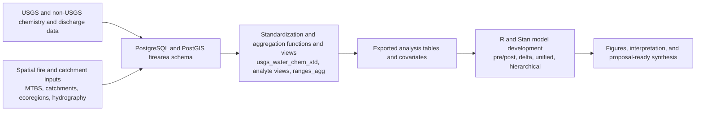

# Quantifying Interactive Effects of Fire and Precipitation Regimes on Catchment Biogeochemistry of Aridlands

[Project Summary](https://lternet.edu/working-groups/fire-and-aridland-streams/)

## Project Goals

This project develops a reproducible, database-centered workflow to quantify how wildfire history and hydrologic variability alter stream chemistry across arid and semi-arid catchments in the southwestern United States.

The current implementation focuses on:

- Harmonizing multi-source chemistry and discharge records into a common analytical framework.
- Linking stream sites to fire exposure through catchment-level and event-level spatial aggregation.
- Estimating pre/post-fire concentration-discharge behavior with progressively structured Bayesian models.
- Producing reusable data products that support synthesis across sites and ecoregions.

This repository is designed for scientific inference and data integration. It is not currently an operational real-time telemetry or early-warning platform.

## Workflow Overview

## Core Data and Processing Pipeline

### 1. Data Standardization in PostgreSQL

The workflow is anchored in the firearea schema in PostgreSQL with PostGIS enabled. Core functions standardize chemistry records, reconcile analyte units/forms, and integrate USGS and non-USGS data streams into analyte-specific views.

### 2. Fire-Event and Catchment Aggregation

Spatial and temporal fire exposure is summarized through derived views and materialized views, including event windows and cumulative burn metrics. These products connect site records to fire-event timing and extent while preserving deterministic ordering for reproducible exports.

### 3. Export and Modeling Handoff

Curated tables are exported for downstream R and Stan workflows. Model development progresses from simple concentration-discharge structure to pre/post-fire, delta, unified, and hierarchical templates.

## Repository Components

- wildfire_database: documentation-first SQL development in Quarto with extraction and execution workflows for building schema objects and export products.
- models: Stan templates that represent increasing structural complexity from baseline CQ models to hierarchical formulations.
- model_fitting: data preparation and model execution scripts for iterative fitting and diagnostics.
- hydrologic_distance: scripts to derive distance-based hydrologic context metrics.
- spatial_covars: spatial covariate extraction and preparation workflows.
- burn_severity: burn severity estimation workflows and supporting documentation.
- conceptual_figure_one, marss_figure_one, figures: synthesis and communication outputs.

## Relationship to the firearea Package

This repository is complemented by the firearea R package in the companion repository. firearea provides reusable functions for watershed delineation, fire-perimeter preparation, flowline-buffer operations, and hydrologic-distance calculations that support upstream data preparation and downstream database integration.

## Reproducibility and Execution

SQL development follows a documentation-first pattern: SQL logic is authored in Quarto source files, extracted into executable SQL, and run against PostgreSQL. This design improves traceability between analytical documentation and database state.

Execution is managed through a lightweight task orchestration layer and environment-variable-driven database targeting, supporting development and production contexts while preserving consistent build semantics.

## Current Scope and Proposal Relevance

The implemented workflow provides a robust foundation for assessing wildfire impacts on aquatic chemistry at site and regional scales, including ecoregion-constrained analyses and standardized multi-source data integration.

For proposal development, the strongest contribution of the current system is its end-to-end reproducible architecture: harmonized chemistry/discharge data, fire-event linkage in the database, and statistically explicit pre/post-fire modeling. Future operational capabilities can build on this foundation, but are not represented here as deployed systems.

## Script and Model Summary

- models includes the following Stan model templates:
1. STAN_lm_template.stan: basic linear model with structure $y = mx + b$.
2. STAN_lm_prepost_template.stan: pre/post-fire split with separate CQ slopes.
3. STAN_lm_delta_template.stan: derives change in slope from pre/post estimates.
4. STAN_lm_delta_unified_template.stan: unified structure estimating all parameters in one model.
5. STAN_lm_hierarchical_template.stan: hierarchical site and cross-site structure (under development).

- model_fitting/STAN_dev_script.R prepares analysis inputs and fits the model sequence.

## PIs

- Tamara Harms, Associate Professor, Environmental Sciences Department, University of California Riverside
- Heili Lowman, Research Scholar, Rhodes Information Initiative, Duke University
- Stevan Earl, Information Manager, Central Arizona-Phoenix Long-Term Ecological Research (CAP LTER)

## References

- Ball, G. F., et al. (2021). Wildfire impacts to aquatic networks in the western United States. Study context for burned-stream-length and downstream propagation framing.
- Dahm, C. N., et al. (2015). Post-fire runoff effects on Rio Grande water quality and ecosystem processes. Case-study basis for episodic disturbance framing.
- Dennison, P. E., et al. (2014). Large wildfire trends in the western United States, 1984-2011. Baseline evidence for long-term fire activity trends.

## Related Repositories

- [hlowman / **crass_bgc**](https://github.com/hlowman/crass_bgc)
- [srearl / firearea](https://gitlab.com/srearl/firearea)
